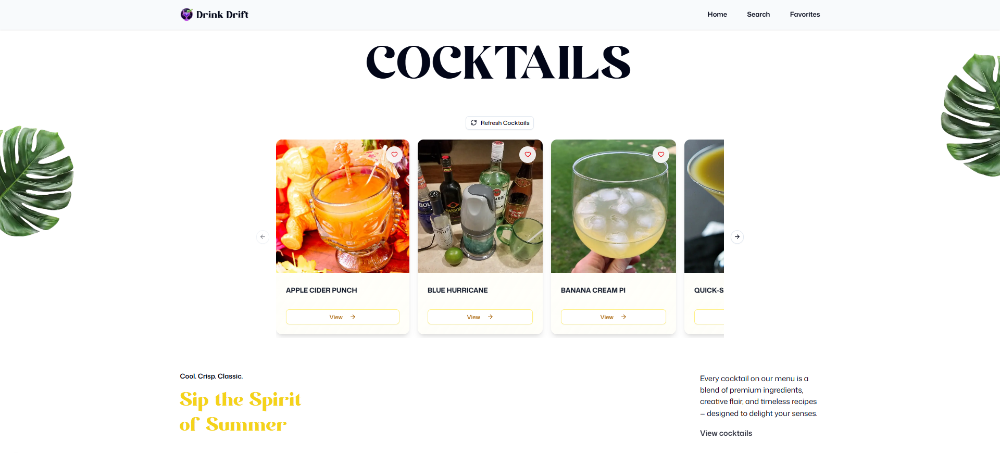

# 🍸 Drink Drift

A modern cocktail discovery app built with Next.js that lets you explore, search, and save your favorite cocktails. Discover new drinks, get detailed recipes, and build your personal collection of favorites.



## ✨ Features

### 🏠 **Feature 1 - Home**

- **Random Cocktail Gallery**: Display 5 unique random cocktails on the home page
- **Smart Duplicate Prevention**: Calls multiple random cocktail APIs simultaneously while ensuring no duplicates are shown
- **Interactive Carousel**: Beautiful carousel display with navigation controls
- **Refresh Functionality**: One-click refresh button to load another unique set of 5 random cocktails
- **Cocktail Preview**: Each cocktail displays its name, image, and category

### 🔍 **Feature 2 - Search**

- **Real-time Search**: Search for cocktails by name with instant results
- **Smart Results Display**: Search results show cocktail name, image, and category
- **Empty State Handling**: Elegant empty state when no search query is entered
- **No Results State**: Helpful messaging when no cocktails match the search
- **Responsive Grid**: Adaptive grid layout for optimal viewing on all devices

### ❤️ **Feature 3 - Favorites**

- **Personal Collection**: Curated list of cocktails added to your favorites
- **Persistent Storage**: Favorites are saved in local storage and persist across sessions
- **Interactive Heart Button**: Add/remove cocktails from favorites with animated heart icon
- **State Management**: Powered by Zustand store for efficient state management
- **Visual Feedback**: Heart button changes color and fill state based on favorite status

### 📋 **Feature 4 - Detail Page**

- **Comprehensive Cocktail View**: Detailed page for each cocktail with full information
- **High-Quality Images**: Large, crisp cocktail images with hover effects
- **Complete Instructions**: Step-by-step preparation instructions
- **Cocktail Metadata**: Category, alcoholic status, and tags display
- **Responsive Design**: Optimized layout for desktop and mobile viewing
- **Easy Navigation**: Accessible via "View" button on each cocktail card

## 🛠️ Tech Stack

### **Frontend Framework**

- **Next.js 15.5.3** - React framework with App Router
- **React 19.1.0** - Latest React with concurrent features
- **TypeScript 5** - Type-safe development

### **Styling & UI**

- **Tailwind CSS 4** - Utility-first CSS framework
- **shadcn/ui** - Accessible UI components

### **State Management**

- **Zustand 5.0.8** - Lightweight state management
- **Local Storage Persistence** - Favorites persist across sessions

### **Search & Navigation**

- **nuqs 2.6.0** - URL state management for search

### **Development Tools**

- **ESLint 9** - Code linting with Next.js config
- **Prettier 3.6.2** - Code formatting with Tailwind plugin
- **Vitest 3.2.4** - Fast unit testing framework
- **Testing Library** - React component testing utilities

## 🧪 Testing

Comprehensive unit test coverage includes:

- **API Route Testing**:
  - Random cocktail API endpoint (`/api/drink/random`)
  - Search cocktail API endpoint (`/api/drink/search`)
- **Component Testing**:
  - Button component functionality and variants
  - Search page component behavior
- **Test Framework**: Vitest with jsdom environment
- **Testing Utilities**: React Testing Library for component testing

### Running Tests

```bash
# Run all tests
pnpm run test
```

## 📱 Responsive Design

- **Mobile-First Approach**: Optimized for mobile devices with progressive enhancement
- **Breakpoint System**: Tailored layouts for mobile, tablet, and desktop
- **Touch-Friendly**: Carousel and buttons designed for touch interaction
- **Flexible Grid**: Adaptive cocktail card layouts (1-4 columns based on screen size)

## 🚀 Getting Started

### Prerequisites

- Node.js 20+
- pnpm, yarn, or npm (this project uses pnpm)

### Installation

1. **Clone the repository**

   ```bash
   git clone https://github.com/inam95/drink-drift
   cd drink-drift
   ```

2. **Install dependencies**

   ```bash
   pnpm install
   # or
   yarn install
   # or
   npm install
   ```

3. **Set up environment variables**
   Create a `.env` file in the root directory:

   ```env
   NEXT_PUBLIC_BASE_URL=http://localhost:3000 (change according your app running port)
   ```

4. **Run the development server**

   ```bash
   pnpm run dev
   # or
   yarn dev
   # or
   npm dev
   ```

5. **Open your browser**
   Navigate to [http://localhost:3000](http://localhost:3000) to see the app in action!

### Build for Production

```bash
# Build the application
pnpm run build

# Start the production server
pnpm run start
```

## 📁 Project Structure

```
drink-drift/
├── src/
│   ├── app/                    # Next.js App Router pages
│   │   ├── api/drink/         # API routes for cocktail data
│   │   ├── cocktail/[id]/     # Dynamic cocktail detail pages
│   │   ├── favorites/         # Favorites page
│   │   ├── search/            # Search functionality
│   │   └── page.tsx           # Home page
│   ├── components/            # Reusable UI components
│   │   ├── ui/                # Base UI components
│   │   ├── cocktail-card.tsx  # Cocktail display component
│   │   ├── favorite-button.tsx # Favorite toggle component
│   │   └── ...
│   ├── lib/                   # Utilities and configurations
│   │   ├── store.ts           # Zustand store setup
│   │   ├── types.ts           # TypeScript type definitions
│   │   └── utils.ts           # Utility functions
│   └── constants/             # App constants
├── public/                    # Static assets
│   └── images/               # Images and icons
├── __tests__/                # Test files
└── package.json              # Dependencies and scripts
```

## 🔧 API Integration

The app integrates with [TheCocktailDB API](https://www.thecocktaildb.com/api.php) to provide:

- Random cocktail fetching with the `/random.php` endpoint
- Cocktail search by name using `/search.php?s=` parameter
- Detailed cocktail information via `/lookup.php?i=` endpoint

**API Endpoints Used:**

- `GET /api/json/v1/1/random.php` - Fetch random cocktails
- `GET /api/json/v1/1/search.php?s={name}` - Search cocktails by name
- `GET /api/json/v1/1/lookup.php?i={id}` - Get detailed cocktail information

_Note: This app uses the free tier of TheCocktailDB API with the test key for development and educational purposes._

**Enjoy exploring cocktails with Drink Drift! 🍹**
